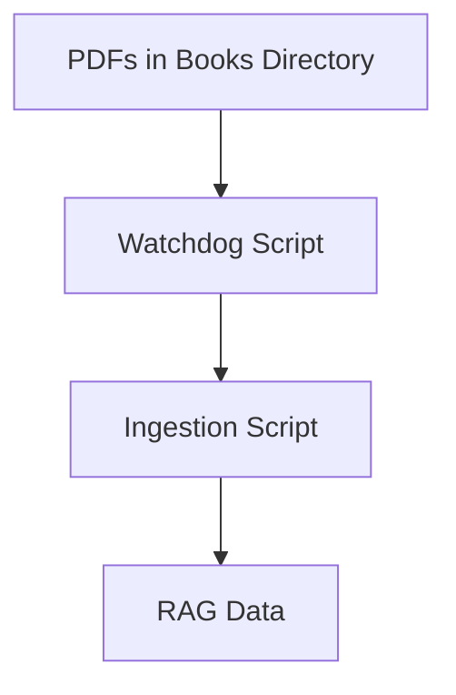
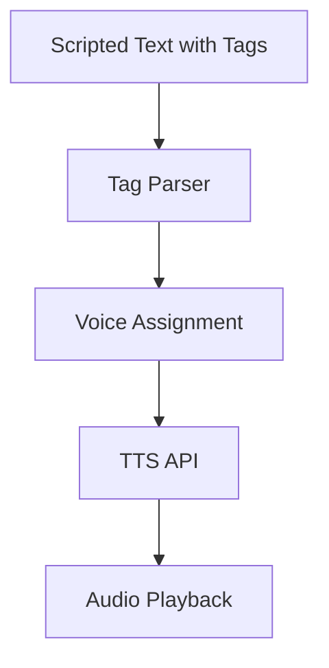

# DNDAI Advanced Usage Guide

This guide covers advanced features and workflows for power users and DMs.

See diagrams below for batch RAG and multi-voice TTS workflows.

---

## Batch & Scheduled RAG Ingestion

- Use `llm-server/scripts/ingest_rag.py --all` to ingest all PDFs in your books directory at once.
- Use `llm-server/scripts/auto_ingest_watchdog.py` to automatically ingest new PDFs as they appear (requires `watchdog` package).
- Schedule ingestion scripts with cron or a task scheduler for regular updates.
- See [RAG-operations.md](../llm-server/RAG-operations.md) for more.

---

## Example: Batch RAG Ingestion with Cron

To run batch ingestion every night at 2am, add this to your crontab:

```
0 2 * * * cd /path/to/DNDAI && /usr/bin/python3 llm-server/scripts/ingest_rag.py --all
```

---

## Diagrams: Batch RAG Ingestion & Multi-Voice TTS

### Batch/Scheduled RAG Ingestion



### Multi-Voice TTS Scripting



#### Example: Multi-Voice TTS Script

```
[NARRATIVE]The wizard enters the room, his robes billowing.[/NARRATIVE]
[SPOKEN]"Who dares disturb my studies?"[/SPOKEN]
[INTERNAL]He seems nervous, but tries to hide it.[/INTERNAL]
```

Assign voices to each tag in the UI for immersive playback.

---

## Custom Persona Prompts

- Use the persona selector or enter a custom persona/system prompt for the LLM.
- Example: `You are a gruff dwarven bartender. Respond in character.`
- Combine with RAG files for book-accurate, in-character responses.

---

## Integration Tips

- The Flask API can be called from other tools, bots, or VTT modules.
- See [api.md](./api.md) for endpoint details and examples.
- The Foundry VTT module (WIP) will enable in-game AI and TTS features.

---

For more, see [dev-guide.md](./dev-guide.md), [user-guide.md](./user-guide.md), and [architecture.md](./architecture.md).
