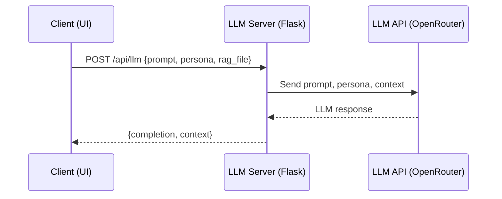

# DNDAI API Reference

This document describes the main API endpoints provided by the DNDAI Flask server.

---

## LLM & TTS Endpoints

### `POST /api/llm`

- **Description:** Get a response from the LLM (optionally with persona and RAG context).
- **Request JSON:**
  ```json
  {
    "prompt": "What is the rule for grappling?",
    "persona": "Gruff Dwarf Bartender",
    "rag_file": "example.md" // optional
  }
  ```
- **Response JSON:**
  ```json
  {
    "completion": "...LLM response...",
    "context": "...RAG context (if any)..."
  }
  ```

### `POST /api/tts`

- **Description:** Generate speech audio from text using TTS.
- **Request JSON:**
  ```json
  {
    "text": "Welcome, traveler!",
    "voice": "Rachel",
    "platform": "elevenlabs" // or "gtts"
  }
  ```
- **Response:**
  - Audio file (MPEG)

### `GET /api/voices`

- **Description:** List available TTS voices (from ElevenLabs).
- **Response JSON:**
  ```json
  {
    "voices": [ { "voice_id": "...", "name": "..." }, ... ]
  }
  ```

See the API Call Sequence Diagram below.

---

## API Call Sequence Diagram (LLM Example)



---

## RAG Management Endpoints

### `
