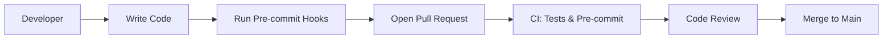

# DNDAI Developer Guide

This guide will help you set up a development environment, run tests, and contribute to DNDAI.

---

## Local Setup

1. **Clone the repository:**
   ```bash
   git clone <repo-url>
   cd DNDAI
   ```
2. **Install Python dependencies:**
   ```bash
   pip install -r llm-server/requirements.txt
   ```
3. **(Optional) Create a `.env` file:**
   - Add your API keys for OpenRouter and ElevenLabs (see `llm-server/README.md`).

---

## Running the Server

```bash
cd llm-server
python3 app.py
```

- The server runs on port 51234 by default.
- Access the demo UI at `http://localhost:51234/`.

---

## Running Tests

```bash
cd llm-server
pytest
```

- All tests are in `llm-server/tests/`.
- CI runs tests automatically on every push/PR.

---

## Code Style

- **Python:** Follow PEP8. Use docstrings and comments.
- **JavaScript:** Use Prettier/ESLint conventions. Keep code modular and well-commented.
- See `CONTRIBUTING.md` for commit and PR guidelines.
- See the Development Workflow Diagram below.

---

## Pre-commit Hooks

- DNDAI uses [pre-commit](https://pre-commit.com/) to enforce code style and formatting for Python and JavaScript.
- **Install hooks:**
  ```bash
  pip install pre-commit
  pre-commit install
  ```
- Hooks will run automatically before every commit (black, flake8, prettier, trailing whitespace, EOF).
- **Run manually:**
  ```bash
  pre-commit run --all-files
  ```
- See `.pre-commit-config.yaml` for details.

---

## Development Workflow Diagram



---

## Debugging Tips

- Use the debug log panel in the demo UI to see how input is parsed and processed.
- Check Flask server logs for backend errors.
- Use browser dev tools for frontend debugging.
- For TTS/LLM issues, verify your API keys and `.env` settings.

---

## How to Contribute

- Read `CONTRIBUTING.md` and `CODE_OF_CONDUCT.md`.
- Open an issue to discuss new features or bugs.
- Create a feature branch for your work.
- Open a pull request when ready for review.

---

For more, see [architecture.md](./architecture.md), [api.md](./api.md), and the main [README.md](../README.md).
